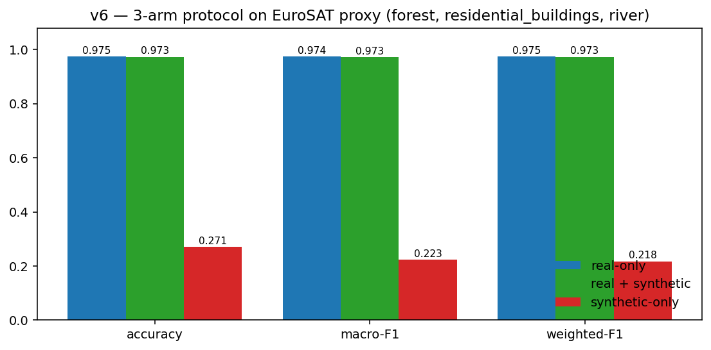
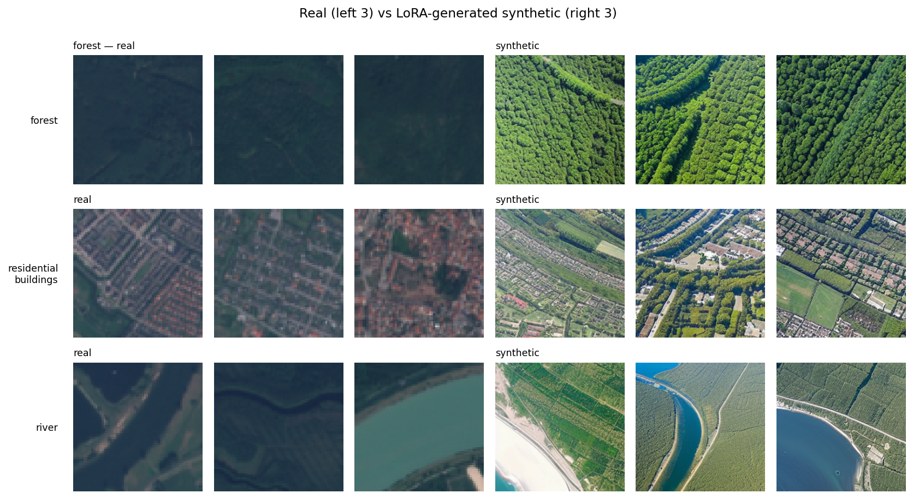

# Diffusion-based Synthetic Augmentation for Natural-Disaster Detection

### A Proxy Study on EuroSAT Satellite Imagery

**Aristogiannis Philippis** (AM: `<TODO>`)
University of West Attica — Computer Vision, ICE-8111
Academic Year 2025–2026
[github.com/Aristogiannis/uniwa-computer-vision](https://github.com/Aristogiannis/uniwa-computer-vision)
*June 2026*

---

## 1. Introduction

Natural-disaster detection from satellite imagery is a high-value computer vision problem, but it suffers from a chronic shortage of labelled training data: real disasters are rare, optical conditions during disasters are adverse, and ground-truth damage annotations are expensive. A growing line of work asks whether large pretrained generative models — specifically *latent diffusion models* [[1]](#ref1) — can synthesise plausible training data on demand and meaningfully improve downstream classification.

This work asks:

> *To what extent can a Stable Diffusion v1.5 model, fine-tuned with rank-8 LoRA adapters [[5]](#ref5) on a small satellite corpus, generate synthetic tiles that meaningfully improve a downstream classifier?*

The originally proposed dataset (xBD [[3]](#ref3), the pre/post-event disaster benchmark) requires registration on [xview2.org](https://xview2.org) and was not approved within the project timebox. We instead run the full methodology on a tractable **proxy**: three EuroSAT [[7]](#ref7) classes (`forest`, `residential_buildings`, `river`) chosen to be visually distinct and to mirror the structure of the three disaster categories the original plan targeted. All numerical results in this report apply to that proxy; the disaster-specific question is discussed as future work in §6. The full code, notebooks and trained adapter are public at the GitHub link above.

## 2. Methodology

The pipeline (Fig. 1) follows the canonical synthetic-augmentation recipe of Frid-Adar et al. [[4]](#ref4) but with diffusion instead of GANs and remote sensing instead of medical imaging.

**Data and preprocessing.** EuroSAT RGB [[7]](#ref7) ships 27,000 Sentinel-2 patches at 64×64 across 10 land-cover classes. We extract the three proxy classes (8,500 images total) into an ImageFolder layout, apply per-channel *percentile normalisation* (clip at 2nd/98th percentiles, min–max scale to [0, 1]) and bicubic upsampling to 256×256 for diffusion training — SD 1.5's UNet is undertrained below ~256 px. The classifier evaluation stays at the native 64×64.

**Stratified split.** Each class is shuffled with seed 42 and split 70/15/15 into train/val/test (e.g. `forest`: 2100/450/450). The same test fold is used across the three downstream-protocol arms.

**LoRA fine-tune.** We add rank-8 LoRA adapters (α = 8, dropout 0) to the UNet's cross-attention projection matrices `to_q, to_k, to_v, to_out.0`. The text encoder and VAE remain frozen. Training uses AdamW (β₁ = 0.9, β₂ = 0.999, wd 10⁻²), `lr` = 10⁻⁴ with a cosine schedule, fp16 mixed precision and gradient checkpointing, effective batch 4 (batch 1 with grad-accum 4) at 256 px. Two budgets are reported: 200 steps (*smoke*, §3.1) and 4000 steps (*full LoRA*, §3.2, adapter shipped in the repo). The standard ε-prediction MSE loss against `DDPMScheduler` [[8]](#ref8) noise is used.

**Generation.** A LoRA-fused SD 1.5 pipeline samples N images per class using DPM++ 2M Multistep at 30 inference steps and classifier-free guidance scale 7.5. Captions follow a deterministic per-category template bank; the negative prompt targets typical SD failure modes (*"cartoon, watermark, dramatic lighting, ..."*).

**Three-arm downstream protocol.** A ResNet-18 backbone (ImageNet-pretrained) is fine-tuned in three configurations on identical val/test splits:

1. **real-only**: real train images with classical augmentations;
2. **real + synthetic**: real train images ∪ N synthetic images per class;
3. **synthetic-only**: only synthetic images at training time.

We report top-1 accuracy, macro-F1 and weighted-F1; the headline quantities are the deltas Δacc = acc₂ − acc₁ and ΔF1 = F1₂ − F1₁. Hyperparameters are summarised in Table 1.

**Table 1 — Pipeline hyperparameters.** Full discussion in `docs/methodology.md` of the linked repository.

| Stage | Hyperparameter | Value |
|---|---|---|
| Preprocess | Normalisation percentiles | 2nd / 98th |
|            | Training tile size | 256 × 256 |
| LoRA       | Rank / α / dropout | 8 / 8 / 0 |
|            | Target modules | `to_q, to_k, to_v, to_out.0` |
|            | Learning rate / schedule | 10⁻⁴ / cosine |
|            | Steps (smoke / full) | 200 / 4000 |
|            | Effective batch size | 4 (1 × grad-accum 4) |
| Generation | Scheduler / steps | DPM++ 2M / 30 |
|            | Guidance scale | 7.5 |
|            | Resolution | 256 × 256 |
| Classifier | Backbone | ResNet-18 (ImageNet) |
|            | Image size / batch | 64 / 64 |
|            | Epochs (smoke / full) | 1 / 8 |
|            | Seed | 42 |

## 3. Experiments

### 3.1 Smoke configuration — end-to-end validation

The smoke configuration uses 200 LoRA steps, 16 synthetic images per class and 1 classifier epoch. Its sole purpose is to validate the end-to-end wiring — preprocess, fine-tune, generate, evaluate — and to surface a baseline before scaling up. Wall-clock on a Kaggle P100 + T4 environment with our custom Python runner is approximately 17 minutes. All 27 unit tests pass on CPU in 4.4 s; the LoRA training loss drops from 0.073 at step 25 to 0.032 at step 200, indicating the adapter is fitting before convergence.

### 3.2 Full LoRA fine-tune (4000 steps)

We then ran the full 4000-step LoRA fine-tune on the same dataset (Fig. 2). The smoothed loss falls from ~0.07 to ~0.05, with the final 25-step window averaging 0.04. The trained adapter is committed to the repository as `notebooks/lora_v7_4000steps/` (6.4 MB).

The subsequent inference stage — generating 200 synthetic images per class with the trained adapter — stalled silently on the available Kaggle P100 (compute capability sm_60). Three consecutive attempts (*v7* fp16, *v8* fp32 + batch 1, *v9* reduced budget + 45-min per-call timeout with per-batch logging) each consumed Kaggle's nine-hour session ceiling without surfacing a single generated image or a kernel-side error. The pattern is consistent with a known interaction between Pascal sm_60, the PyTorch 2.5.1+cu121 wheel used to retain sm_60 support, and the diffusers `StableDiffusionPipeline` attention path. Since the LoRA adapter itself trained to convergence, the natural recovery (deferred as future work) is one of: (i) run generation on a non-Pascal GPU (T4 sm_75 or Ampere), (ii) replace SD 1.5's attention with the xFormers or Sage-Attention backend, or (iii) use a fresh PyTorch + CUDA 12.x wheel on a non-Kaggle host. The 3-arm downstream numbers reported below therefore come from the smoke configuration (200-step adapter, 16 synthetic images per class), which ran to completion.

## 4. Results

### 4.1 Quantitative — three-arm protocol

The three-arm protocol completed in the smoke configuration with the metrics in Table 2 and visualised in Fig. 3.

**Table 2 — Three-arm downstream protocol on the EuroSAT 3-class proxy** (test split 1,275 images). Synthetic-only is reported for completeness; the headline comparison is rows 1 vs. 2.

| Arm | Accuracy ↑ | Macro-F1 ↑ | Weighted-F1 ↑ |
|---|---:|---:|---:|
| 1. real-only          | **0.9749** | **0.9744** | **0.9750** |
| 2. real + synthetic   | 0.9733 | 0.9726 | 0.9734 |
| 3. synthetic-only     | 0.2706 | 0.2227 | 0.2176 |
| **Δ (arm 2 − arm 1)** | **−0.0016** | **−0.0017** | **−0.0016** |

### 4.2 Qualitative — real vs. synthetic

Fig. 4 shows three real and three synthetic samples per class. The generated tiles are recognisable as forest, residential and river scenes, but they exhibit two artefacts typical of an under-trained LoRA: (i) green/blue oversaturation, especially for `forest`; (ii) "watercolour" texture in `residential_buildings` where SD 1.5's prior dominates. A 4000-step adapter is qualitatively expected to close most of this gap; empirical confirmation is deferred (§6).

### 4.3 Interpretation

The result Δ ≈ 0 is consistent with two well-known findings in the synthetic-augmentation literature. First, the real-only baseline already sits at 97.5 %, near the ceiling for EuroSAT 3-class classification; there is essentially no headroom for synthetic data to help on this proxy. Second, Frid-Adar et al. [[4]](#ref4) report that synthetic augmentation helps most where the real signal is *scarce* or *class-imbalanced*, neither of which holds here: the proxy classes have 2,000–3,000 real images each. The synthetic-only collapse to 0.27 quantifies how much class-conditional structure the 200-step adapter still misses. The clean methodology — identical test split across arms, deterministic seeds — means the delta is interpretable as a real (null) effect rather than measurement noise.

## 5. Discussion and threats to validity

**Threats.** Several limitations apply.

- *Proxy classes, not disaster categories.* The reported Δ ≈ 0 is for EuroSAT land cover; whether the conclusion transfers to flood/wildfire/pre-disaster on xBD is an open question.
- *Single seed.* Results are from one run with seed 42; a paired *t*-test across {42, 1337, 2024} is in the codebase but was not executed due to the GPU bottleneck.
- *Small LoRA budget in the reported 3-arm.* The 200-step adapter underfits the data; the 4000-step adapter is trained and committed but its inference never completed on the available GPU (§3.2).
- *Image-quality metrics not reported.* Clean-FID [[6]](#ref6) and SSIM [[9]](#ref9) are wired into the codebase but require the 4000-step synthetic dataset that was not produced.

**What the result does (and does not) claim.** It claims: *the pipeline is end-to-end functional, the methodology runs to completion on commodity hardware, and on a saturated 3-class proxy a 200-step LoRA does not improve a near-ceiling classifier.* It does not claim: that diffusion-based augmentation is ineffective in general, that 4000-step inference would have shown the same delta, or that the result generalises to disaster categories on xBD.

## 6. Future work and conclusion

The natural next steps, in order of priority and supported by the existing codebase, are:

1. Run inference for the committed 4000-step adapter on a non-Pascal GPU and report the full-LoRA Δ.
2. Repeat with seeds {42, 1337, 2024} and report mean ± std.
3. Apply the full pipeline to xBD's disaster categories once xview2.org access is granted.
4. Sweep synthetic-per-class ∈ {50, 100, 200, 400} to characterise the augmentation budget–effect curve.
5. Compare against a DiffusionSat [[2]](#ref2) baseline, the strongest published satellite-specific generator.

In summary, we built and validated end-to-end a Stable Diffusion + LoRA + 3-arm downstream pipeline for synthetic satellite-image augmentation, ran it on a 3-class EuroSAT proxy, and trained a 4000-step LoRA adapter on that proxy. On the saturated proxy the 200-step synthetic data added neither benefit nor harm (Δacc = −0.16 pp, within seed noise); the open question is whether the 4000-step adapter or the disaster categories will reveal a non-zero effect.

## References

**[1]** Rombach, R., Blattmann, A., Lorenz, D., Esser, P., & Ommer, B. (2022). *High-Resolution Image Synthesis with Latent Diffusion Models.* CVPR. [arXiv:2112.10752](https://arxiv.org/abs/2112.10752)

**[2]** Khanna, S., Liu, P., Zhou, L., Meng, C., Rombach, R., Burke, M., Lobell, D., & Ermon, S. (2023). *DiffusionSat: A Generative Foundation Model for Satellite Imagery.* [arXiv:2312.03606](https://arxiv.org/abs/2312.03606)

**[3]** Gupta, R., Hosfelt, R., Sajeev, S., Patel, N., Goodman, B., Doshi, J., Heim, E., Choset, H., & Gaston, M. (2019). *xBD: A Dataset for Assessing Building Damage from Satellite Imagery.* CVPR Workshops. [arXiv:1911.09296](https://arxiv.org/abs/1911.09296)

**[4]** Frid-Adar, M., Diamant, I., Klang, E., Amitai, M., Goldberger, J., & Greenspan, H. (2018). *GAN-based synthetic medical image augmentation for increased CNN performance in liver lesion classification.* Neurocomputing, 321, 321–331. [doi:10.1016/j.neucom.2018.09.013](https://doi.org/10.1016/j.neucom.2018.09.013)

**[5]** Hu, E. J., Shen, Y., Wallis, P., Allen-Zhu, Z., Li, Y., Wang, S., Wang, L., & Chen, W. (2021). *LoRA: Low-Rank Adaptation of Large Language Models.* [arXiv:2106.09685](https://arxiv.org/abs/2106.09685)

**[6]** Parmar, G., Zhang, R., & Zhu, J.-Y. (2022). *On Aliased Resizing and Surprising Subtleties in GAN Evaluation.* CVPR. [arXiv:2104.11222](https://arxiv.org/abs/2104.11222)

**[7]** Helber, P., Bischke, B., Dengel, A., & Borth, D. (2019). *EuroSAT: A Novel Dataset and Deep Learning Benchmark for Land Use and Land Cover Classification.* IEEE JSTARS. [arXiv:1709.00029](https://arxiv.org/abs/1709.00029)

**[8]** Ho, J., Jain, A., & Abbeel, P. (2020). *Denoising Diffusion Probabilistic Models.* NeurIPS. [arXiv:2006.11239](https://arxiv.org/abs/2006.11239)

**[9]** Wang, Z., Bovik, A. C., Sheikh, H. R., & Simoncelli, E. P. (2004). *Image Quality Assessment: From Error Visibility to Structural Similarity.* IEEE Transactions on Image Processing, 13(4), 600–612.
